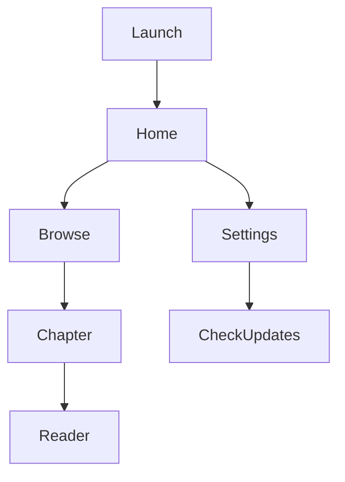
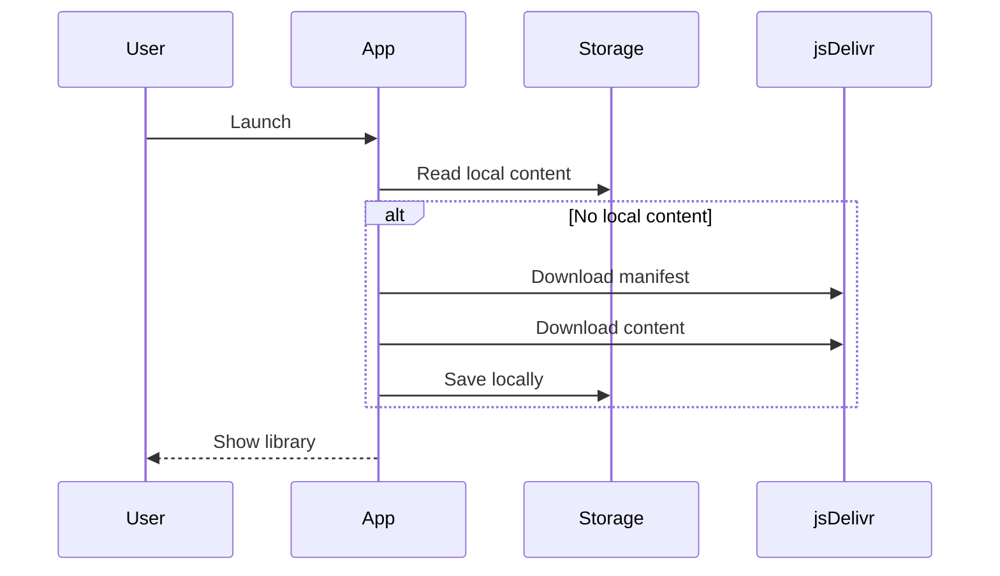
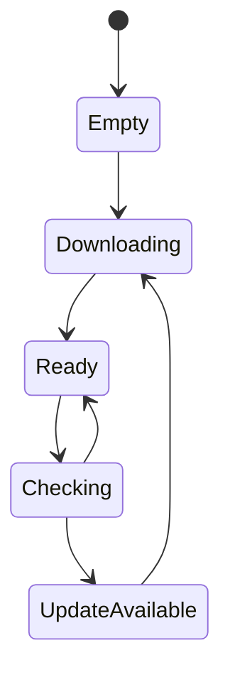

# Mobile Product Specification

← [Documentation index](README.md) · [Mobile product brief](../apps/mobile/docs/product-brief.md)

## Status and scope

**Draft product requirements, not a description of everything shipped.** Keep this document version-controlled alongside implementation so product decisions can be reviewed. `AGENTS.md` remains normative; [Publication identity and safe migration](publication-model.md) defines the proposed shared-book model and compatibility requirements. See [Tech implementation](../apps/mobile/docs/tech-implementation.md) for the current app and [Roadmap](roadmap.md) for outstanding work. Adoption-aware discovery, canonical download keys, and downloaded-content revision checks still require implementation.

## Vision

Akshar is an offline-first mobile reader for structured Indian school textbook content. The app consumes content published from this repository via jsDelivr, making textbooks, transliterations, and translations easily accessible for parents and students.

### Goals

- Fast first-time onboarding.
- Fully offline reading after content download.
- Manual, user-controlled content updates.
- Simple navigation by curriculum.
- Stable content model matching the repository.

### Non-goals (MVP)

- User accounts.
- Automatic background replacement of downloaded chapter content; catalog metadata refresh is separate.
- Editing or contributing content from the app.

---

# Personas

- Parent helping a child with homework.
- Student reading lessons offline.
- Contributor verifying published content.

---

# User Stories

- Browse textbooks by learner grade, subject/language role, book, edition, and chapter, with optional board, state, medium, publisher, and series filters.
- Find the same Kannada book through Grade 3 first-language or Grade 5 second-language usage without duplicating its content or changing the learner's grade.
- Download content at the grade, subject, or individual chapter level.
- Download content automatically when the app has no local data.
- Read lessons offline.
- Manually check for updates.
- Continue reading from the previous location.
- Switch between original text, transliterations, and translations.

---

# Information Architecture

Browsing is a view over catalog metadata, not a reflection of source folders. A book edition can have several adoption records linking it to learner grades and language roles. Keep printed grade separate from learner grade. For the maintainer-confirmed Kannada example:

```text
Grade 3 → Kannada → First language  ─┐
                                     ├→ Savi Kannada → same edition → all chapters
Grade 5 → Kannada → Second language ─┘
```

These are logical references, not filesystem symlinks. Both routes resolve to one canonical book/edition; grade and language role stay paired. An unfiltered book search should show one result with both usage labels. Source provenance must distinguish an official publication listing from reported school usage; neither an adoption nor a translation establishes school medium. See the [adoption-record design](publication-model.md#one-book-multiple-adoption-records).

Download actions operate on the selected books/editions within a browsing context. When multiple publications match, choose the intended books before bulk download; do not silently download every alternative publisher or edition.

- Grade: Download all chapters of the selected books across subjects within the grade.
- Subject: Download all chapters of the selected books for that subject.
- Chapter: Download only that chapter.
- Board, State, and Medium do not expose download actions to avoid excessively large downloads.

Downloaded items display actions similar to Netflix:

- Refresh: Check for newer content for that downloaded scope and sync if available.
- Delete: Remove the downloaded content while preserving unrelated downloads.

Resolve adoption references to canonical chapter IDs before downloading so shared editions are stored once. Removing a book from one profile/context must not silently delete offline files used by another; device-wide deletion must be explicit. Keep progress separate by learner/profile, while preserving the same learner's progress when switching between adoption routes to the same edition.

```text
Home
├── Continue Reading
├── Browse
│   ├── Board
│   ├── State
│   ├── Medium
│   ├── Grade
│   ├── Subject / Language role
│   ├── Book
│   ├── Edition
│   ├── Chapter
│   └── Reader
└── Settings
    ├── Storage
    ├── Check for Updates
    └── About
```

---

# Screen Flow



---

# Content Synchronization

## First Launch

1. Check local content.
2. If missing, download the latest manifest from jsDelivr.
3. Download required content.
4. Save locally.
5. Open the home screen.

## Manual Updates

Users explicitly tap **Check for Updates** from Settings.

The intended downloaded-content update flow compares stored chapter revisions with the catalog, then prompts before replacing downloaded content. A newly available edition is a separate selection, not an automatic replacement. Updates must preserve progress and last-known-good offline files on failure. The current app refreshes catalog metadata on startup, but downloaded-content revision checks and this manual replacement flow are not yet implemented; a catalog refresh alone does not update offline chapters.



---

# Update State Machine



---

# Offline Strategy

- Store downloaded content locally.
- Never require network access while reading.
- Continue using cached content if update checks fail.
- Preserve reading progress across updates.

---

# CDN Architecture

```text
GitHub Repository
        |
        v
   jsDelivr CDN
        |
        v
 Manifest JSON
        |
        v
 Chapter JSON
        |
        v
 Local Storage
        |
        v
 Reader UI
```

Target publishing requirements:

- Repository YAML is the source of truth; API JSON is generated.
- Publish chapter revisions at immutable locators; do not assume a mutable branch URL is immutable.
- Catalog revisions discover changes; per-chapter content revisions determine downloaded-content update availability.
- Preserve supported legacy URLs and client contracts through the migration bridge; cache headers alone do not migrate identities.

---

# Local Data

Track:

- Installed content version.
- Selected adoption context and canonical book/edition IDs, independently of printed grade.
- Downloaded chapters keyed by canonical identity with saved revisions and shared profile/context references.
- Reading progress keyed by learner/profile and canonical chapter/segment identity.
- User preferences.

---

# Roadmap

## MVP

- Browse curriculum.
- Offline reader.
- Manual updates.
- Reading progress.

## Future

- Premium AI-powered features (for example, image models).
- User authentication for premium capabilities only.
- Core browsing, downloading, offline reading, and update flows remain available without login.
- Search.
- Adoption-aware browse/search for shared books, with deduplicated results/downloads and backward-compatible selection migration.
- Bookmarks.
- Favorites.
- Multiple transliteration preferences.
- Audio support.
- Contributor mode.

---

# Acceptance Criteria

- Navigation is fully defined.
- Offline behavior is deterministic.
- Manual update flow is specified.
- CDN architecture is documented.
- Document serves as the living product specification.
- Grade 3 first-language and Grade 5 second-language Kannada both find the complete shared edition; Grade 5 users remain Grade 5 users.
- Shared content downloads once, different learners retain independent progress, and deleting one context does not break another's offline access.
